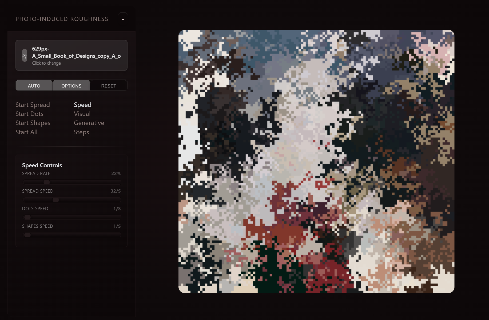

# photo-induced-roughness

  

      
       
      <a href="https://jo56.github.io/photo-induced-roughness" target="_blank">
          <b>https://jo56.github.io/photo-induced-roughness</b>
      </a>
  

 

Allows users to upload images which are then converted into a grid that runs cellular automata-like spread patterns, changing and distorting the pictures with random variance to create new images. 

### Quick Start

1. `npm install`  
2. `npm run dev`

This project uses **Vite + React + TypeScript**. The primary app is `src/App.tsx` (default export component).  

The canvas is responsive; use the controls to start/stop, step, randomize, and clear the simulation.

### Controls

**Space**,**J**,**K**,**L** toggle **Spread**, **Dots**,**Shapes**,**All** respectivley.

Pres **R** to toggle recording when enabled
